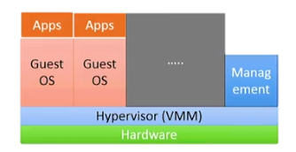

> Lorenzo De Bie

# Cloud
## Definitie
Veel discussie over wat de cloud juist is:
* 451 group: *The cloud is IT as a Service, delivered by IT resources that are independent of location*
* Gartner: *Cloud computing is a style of computing where massively scalable IT-related capabilities are provided 'as a service' across the Internet to multiple external customers*
* Forrester: *A pool of abstracted, highly scalable, and managed infrastructure capable of hosting end-used application and billed by consumption*
* Wikipedia: *A style of computing in which dynamically scalable and often virtualized resources are provided as a service over the Internet. Users need not have knowledge of, expertise in, or control over the technology infrastructure 'in the cloud' that supports them*

**EXAMEN** Belangrijkste definitie komt uit paper "[A break in the clouds: towards a cloud definition](http://ccr.sigcomm.org/online/files/p50-v39n1l-vaqueroA.pdf)":
*Clouds are a large pool of easily usable and accessible **virtualized** resources (such as **hardware, development platforms** and/or **services**). These resources can be dynamiccaly reconfigured to adjes to a variable load (**scale**), allowing also for an optimum resource utilizations. This pool of resources is typacally exploited by a **pay-per-use** model in which guarantees are offered by the Infrastructure Provider by means of customized SLAs (Service Level Agreements).*

### SLA
Service Level Agreements: contract die garanties levert voor  o.a. uptime, met typisch boeteclausules indien deze uptime niet gehaald wordt. Bvb. Netflix heeft SLA met Amazon voor 99.5% uptime, en boetes voor Amazon aan Netflix indien dit niet gehaald wordt.

### Gemeenschappelijke eigenschappen van definities:
* Pay-per-use, geen verplichtingen om een bepaalde hoeveelheid te gebruiken (geen contract om x aantal servers te huren).
* Elastisch: resources kunnen upscalen en downscalen on demand.
* Self-service interface
* Resources are abstracted/virtualised. Virtualisatie (en tegewoordig ook containerisatie) is een van de bouwstenen voor de cloud. Deze technologieën hebben de cloud gelanceerd.

## **EXAMEN** Economics of Cloud Users
* Riskof over-provisioning: underutilization

* Heavy penalty for under-provisioning

* Pay by use: Static data center vs Data center in the cloud

Cloud providers have the benefit of **Economy of scale**. They get much better deals than regular consumers when buying hardware, power...

Big cloud providers (Amazon, Microsoft, Google) have thousands of the same machine, when one machine fails -> move image. Smaller providers have multiple generations of processors.

## What does cloud computing do?
* Provide online data storage/retrieval
* Enable access to online applications
* Provides computing platform and computing infrastructure
	* E.g. simulations / rendering
* Cloud technology can provide services through a public or private network or the Internet, where the service hosting system is at a remote location
	* E.g. private cloud between 5 hospitals

User only requires connectivity, they can use software, platform and computing infrastructure in the cloud. E.g. office365, google docs opening ppt when you don't have the ppt app (google docs interprets ppt)

## Cloud Characteristics
* Off-premise (except private cloud)
	* Service hosted and delivered from location belonging to service provider
	* Over public Internet in case of public cloud
	* Processing occurs outside company's firewall
* Elasticity
	* Inherent scalability of service provider
	* Rapidly scale up and down resources
* Flexible billing
	* Fees on subscription basis or tied to actual consumption or reservation of resources
	* cost effective
* Virtualization
	* Cloud services often offered through virtualization mechanisms
	* Cost optimization through **[Multi-Tenacy](#EXAMEN%20Multi-Tenacy)**
		* Multiple users on a single node. E.g. one massive server running 10 vm's.
* Affordable resources
	* Cost of resources dramatically reduced
	* No requirement for fixed purchases
	* Multiplexing demand
	* Economy of scale of service providers
* On-demand self-service
	* When needed, request the service
	* when requested, service is provisioned on-demand

## History
* 1930's renting out electric accoutning machines based on punch cards to offer data processing services (E.g. payrolls)
* 1960's-1970's: timesharing of mainframe computers and teletypes
* Early 90's: grid computing
	* Collection of computer resources from mutliple locations collaborate to reach a common goal
	* E.g. FightAIDS@Home analyzing molecule structures to find a cure
* Late 90's: Utility computing
	* Offering computing resources as a metered service

The cloud is not a new technology. **Cloud is a combination of pre-existing technologies**.

## Gartner Hype Cycle - Cloud
Much traction & many articles -> realise it won't solve everything -> learn what it is good for -> businesses know how and what to use it for 

Cloud computing has reached the plateau of productivity

### Cloud Consumer Behaviour Drives Enterprises
Enterprise products, services and business models are rapidly transorfming because of the fundamental shift in consumer behavior as a result of cloud computing. Cloud computing occupies an unusual place in the technology landscape. It has become ubiquitous through consumer products and services but is still an emerging technology for a large proportion of institutions.

Clients are expecting that they can shop/access data through an online platform. E.g. Zalando has become the biggest shoe shop in the last 5-10 years. Citizens expect to be able to access their data through a government website.

## **EXAMEN** Cloud Deployment Models
### Public cloud
A cloud hosted and operated by a service provider.
* Everybody can become a client
* Common infrastructure shared by everyone

* Enables public systems and servie access
	* Access via well-defined & published Web Services
	* Access via management portal
* Maintained and monitored by others
* Free or pay-per-use
	* Free: e.g. Virtual wall on ugent is free for researchers or students if your project is accepted by the university.

### Comunnity cloud
A cloud hosted and operated by a service provider for a limited number of clients with common interests (e.g. hospitals).
* Special security/reliability/availability requirements

*Break the glass procedure*: Breaking privacy rules in certain situations (e.g. hospital worker needs to see medical records of patient in emergencies). Accountability comes later.

### Private cloud
A cloud for a single client only. Hosted and operated by a service provider or the organization itself.
* Strict security/reliability/availability requirements

* Emulate Public Cloud on private/internal resources
* Enable service access within an organization
* Due to its private nature, it *can* be more secure
	* Virtual wall is probably less safe than Google Cloud -> different concers
* Gives elasticity of Cloud while:
	* Full control **but** also **full responsibility**
	* Maintaining control of resources (security)
	* Meeting corporate / regulatory requirements (governance)
	* Option to scale out to Public Cloud (cloudburst)
		* **Cloudbursting**: Normal use -> own resources, peak of workload -> also use public cloud resources to handle peak.

### Hybrid Cloud
public cloud + private cloud, **with automatic cloudbursting**

* Private cloud supports critical activities
* Public cloud supports non-critical activities
* Can outsource non-critical functions

## \*\*EXAMEN\*\* Cloud Models
This picture on exam + examples

### On-Premises
#### Examples:
* IDLab virtual wall
### Infrastructure (as a Service)
* Provides cloud users with physical ([bare] metal as a Service) or virtual computational, storage and networking resources
* Virtual machines run by a hypervisor
* Newer: containers run on a container orchestration platform (e.g. kubernetes as a service)
* Lots of additional features
	* Monitoring
	* Accounting
	* VM image library
	* Container repositories
	* Storage
	* Firewalls
	* ...
* Cloud Provider leases Virtual Machine instances (i.e. computer infrastructure) to users
* User has access to a standard Operating System (Ubuntu, Windows, Debian, Arch) environment and can install and configure all layers above it
#### \*\*EXAMEN\*\* Multi-Tenacy

*How do we share a physical computer among multiple users?*
* **Abstraction**
	* Introduce an abstract model of what a generic computing resource should look like (CPU cores, RAM, network adapter, graphics adapter, storage)
	* The physical computer resource then provides this abstract model to many users
	* Avouds creating dependencies on physical resources
* [Virtualization](#Virtualization) allows distributed computing models without creating dependencies on physical resources
* Clouds are based on [Virtualization](#Virtualization)
	* Offes services based mainly on vritual machines, remote procedure calls, and client/servers
	* Provide lots of servers to lots of clients
#### Examples:
* VM's/Containers on Amazon/Google/Azure
* Closed IaaS Cloud offerings:
	* AWS (Elastic Compute Cloud [EC2])
	* Google Compute Engine
	* Microsoft Azure
	* IBM Cloud
	* Oracle CLoud
	* VMWare
* Open IaaS Cloud offerings:
	* OpenStack
	* CloudStack
	* OpenNebula
	* Eucalyptus
### Platform (as a Service)
#### Examples:
* Applications on Amazon/Google/Azure
### Software (as a service)
#### Examples:
* Office365
* AdobeCloud
* Netflix

## Virtualization
### What is virtualization?

Virtualization is a **hardware level abstraction**. It provides virtual hardware such as processors, memory, chipset, I/O devices, etc. Virtualization encapsulates all OS and application state.

The **virtualization software** gives an extra level of indirection and decouples hardware and OS. It multiplexes physical hardware across multiple "guest" VMs.

It's also responsible for providing strong isolation between VMs. The virtualization layer can use extensions in modern hardware to provide this isolation. This isolation is much stronger than with containers. 

It also manages all the physical resources and improves utilization of these resources. Chipset hardware also aids in performace: Memory Management Unit virtualization allows guest VMs to directly use periphal devices (ethernet, GPU, etc.)

### What are the benefits of virtualization?

Example of Failure Isolation: If one application has a memory leak and the memory fills up, the application and maybe the whole VM will crash. This won't crash any other VMs.

#### VM Encapsulation
A Virtual machine an archive file which contains the OS, applications, data and the memory and device state in a generic model. This makes it possible to suspend the VM and restore the entire machine state on another machine.

#### VM Compatibility
A VM needs to be hardware independent. The virtualization layer will expose standard virtual hardware to the VM and thus hide the physical hardware. This prevents configuration issues and makes it possible to migrate VMs between hosts.
Virtualization also makes it possible to run ancient OS on new platform (e.g. DOS VM on modern hardware [DOSBox])

#### List of benefits
* Run OSs where the physical hardware is unavailable (e.g. DOS)
* Easier to create new machines, backup machines, etc.
* Software testing using "clean" installs of operating systems and software
* Emulate more machines than are physically available
* Timeshare lightly loaded systems on one host
* Debug problems (suspend and resume the problem machine)
* Easy migration of virtual machines (shutdown needed or not)
* Run legacy applications

### Purpose and benefits of virtualization for cloud computing
Cloud companies have physical resources and want to multiplex the demand of their customers on these physical resources and maximise the utilization of these resources. Cloud companies don't buy new hardware everytime a client asks to spin up a VM.

Clients of these companies can put their data and applications on these VMs

### Common Virtualization uses today
**Test and development** servers can be rapidly provisioned. Businesses can store libraries of pre-configured test machines. Now developed software can quickly be tested on Windows 7, Windows 10, Mac and Linux.

Virtualization is used to provide **business continuity**. If anything happens to our own infrastructure we can quickly cloudburst all the applications since they are encapsulated in a VM.

Virtualization can be used to secure unmanaged PCs without compromising end-user autonomy by layering a security policy in software around dekstop virtual machines. E.g. a security policy preventing copying files to a usb stick can be applied by a hypervisor. This is called **Enterprise desktop** .

It is possible to reduce costs by consolidating services onto the fewest number of physical machines. This is sometimes calles **Server consilidation**.

## Virtual Machines and Hypervisors
The **hypervisor** is an extra layer between the hardware and the VMs that enables creation, management and governance of VMs. An older name for this layer is the **Virtual Machine Monitor**. These earlier VMMs were implemented fully in firmware. Today, VMMs are often implemented as a co-designed firmware-software layer, referred to as the hypervisor.

### Process VMs vs. VM Monitors
* Process VM: A runtime system that executes a program that is compiled to intermediate (portable) code. The JVM (Java Virtual Machine) is an example of a Process VM.
* VM Montior (Hypervisor): A seperate software layer mimics the instruction set of hardware. A complete OS and its applications can be supported. VMWare and VirtualBox are examples of VM monitors.

### **EXAMEN** Evolution of Virtualization Software Solution

#### Basic Overview
First generation of virtualization software implemented **full virtualization** (binary rewriting). The translation layer introduces a lot of overhead, which makes this version of virtualization very slow.

Second generation of virtualization software uses **paravirtualization**. Here the concept of a **hypervisor** is also introduced. To lower overhead and speed up changes are made to the virtual machine to let them know they are in fact *virtual* machines. These changes allow the VM to speak directly to the hardware using the hypervisor. 

Modern virtualization software uses **silicon-based virtualization** (hardware-assisted). VMs can now access the hardware using the hypervisor without modifications to the VMs. CPU manufacturers created specialized instruction sets to allow these VMs to talk to the hardware directly. This allows the VM to reap the benefits of hardware acceleration.

#### Full Virtualization (Outdated)
Traditional VMMs provide full-virtualization, meaning that everything is virtualized. The VMM has to provide full hardware emulation. The functionality provided by the VMM is identical to the underlying physical hardware, and is exposed to the VMs. This allows unmodified guest OSs (designed for the same CPU) to be run in isolation on the VMs. The VM does not know it is running on emulated hardware. This emulation step introduces a lot of latency and may result in some performance degradation.

Some examples include VirtualBox, Virtual PC, VMWare, QEMU...

* Pros
	* Disaster recovery, failover
	* Legacy code on non-legacy hardware (e.g. DOSBox)
* Cons
	* **Latency** of four core resources (from most to least percentage of performance reduction)
		* RAM
		* Disk I/O
		* Network
		* CPU

#### Paravirtualization

#### Silicon-based Virtualization