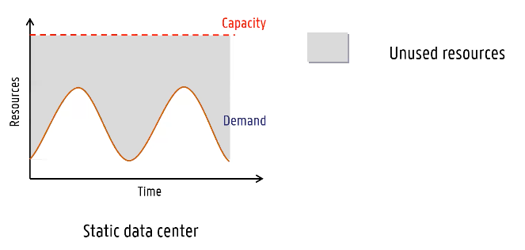

> Lorenzo De Bie

# Cloud
Belangrijkste definitie komt uit paper "[A break in the clouds: towards a cloud definition](http://ccr.sigcomm.org/online/files/p50-v39n1l-vaqueroA.pdf)":
*Clouds are a large pool of easily usable and accessible **virtualized** resources (such as **hardware, development platforms** and/or **services**). These resources can be dynamiccaly reconfigured to adjes to a variable load (**scale**), allowing also for an optimum resource utilizations. This pool of resources is typacally exploited by a **pay-per-use** model in which guarantees are offered by the Infrastructure Provider by means of customized [SLA's](Cloud.md#SLA) (Service Level Agreements).*

## **EXAMEN** Economics of Cloud Users
* Riskof over-provisioning: underutilization

* Heavy penalty for under-provisioning

* Pay by use: Static data center vs Data center in the cloud

## Economy of Scale
> Prob zeer belangrijk want heeft lang aan deze slide bezig geweest

Cloud providers have the benefit of **Economy of scale**. They get much better deals than regular consumers when buying hardware, power...

Big cloud providers (Amazon, Microsoft, Google) have thousands of the same machine, when one machine fails -> move image. Smaller providers have multiple generations of processors.

## **EXAMEN** Cloud Deployment Models
### Public cloud
A cloud hosted and operated by a service provider.
* Everybody can become a client
* Common infrastructure shared by everyone

* Enables public systems and servie access
	* Access via well-defined & published Web Services
	* Access via management portal
* Maintained and monitored by others
* Free or pay-per-use
	* Free: e.g. Virtual wall on ugent is free for researchers or students if your project is accepted by the university.

### Comunnity cloud
A cloud hosted and operated by a service provider for a limited number of clients with common interests (e.g. hospitals).
* Special security/reliability/availability requirements

*Break the glass procedure*: Breaking privacy rules in certain situations (e.g. hospital worker needs to see medical records of patient in emergencies). Accountability comes later.

### Private cloud
A cloud for a single client only. Hosted and operated by a service provider or the organization itself.
* Strict security/reliability/availability requirements

* Emulate Public Cloud on private/internal resources
* Enable service access within an organization
* Due to its private nature, it *can* be more secure
	* Virtual wall is probably less safe than Google Cloud -> different concers
* Gives elasticity of Cloud while:
	* Full control **but** also **full responsibility**
	* Maintaining control of resources (security)
	* Meeting corporate / regulatory requirements (governance)
	* Option to scale out to Public Cloud (cloudburst)
		* Cloudbursting: Normal use -> own resources, peak of workload -> also use public cloud resources to handle peak.

### Hybrid Cloud
public cloud + private cloud, **with automatic cloudbursting**

* Private cloud supports critical activities
* Public cloud supports non-critical activities
* Can outsource non-critical functions